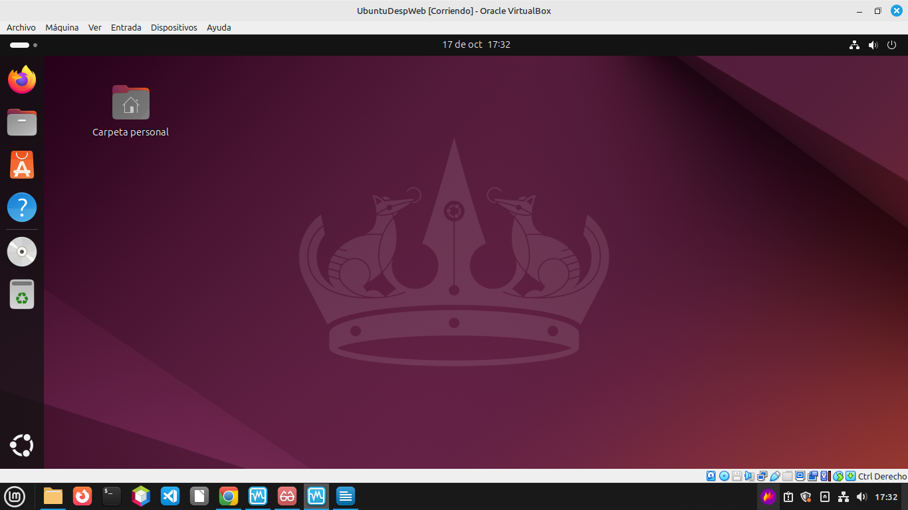
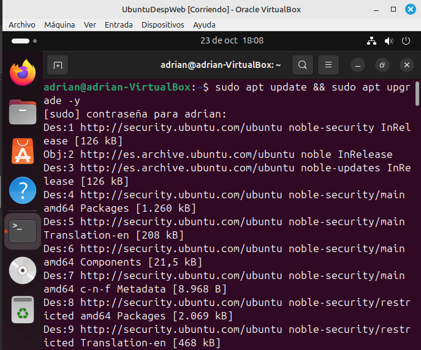
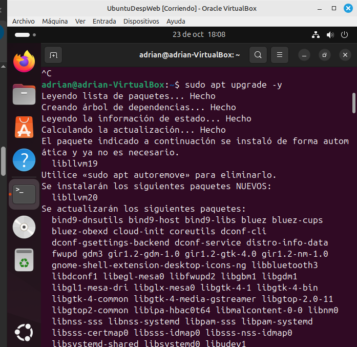
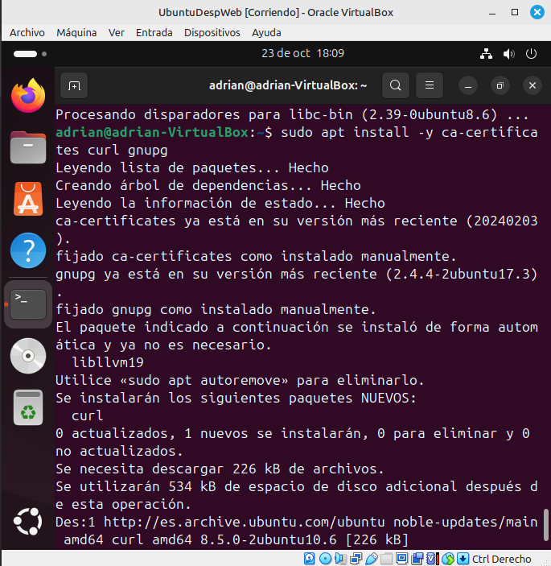
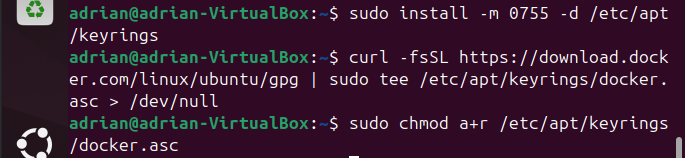
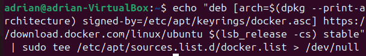
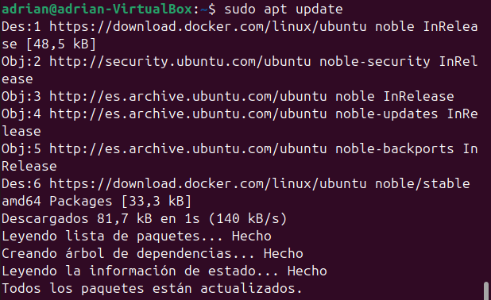
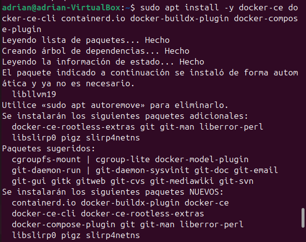
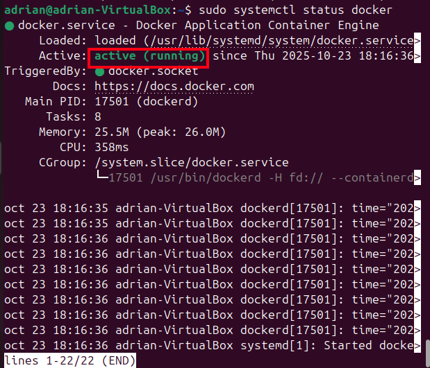

# Iniciación a la Virtualización
---

## 1. Escritorio Ubuntu

En esta captura podemos ver nuestro escritorio de Ubuntu ya instalado y operativo.



---

## 2. Instalación de Docker Desktop

#### Actualización del sistema:

Realizamos la actualización completa del sistema operativo.





#### Instalación de dependencias necesarias:

Instalamos los paquetes necesarios para manejar la descarga de claves y repositorios.



#### Agregar la clave GPG de Docker:

Se instalan y añaden los directorios y la clave GPG necesaria.



#### Agregar el repositorio oficial de Docker:

Añadimos el repositorio estable de Docker a la lista de fuentes del sistema.



#### Instalar Docker:

Instalamos el motor de Docker (Docker CE).



#### Verificar la instalación:

Verificamos que el servicio de Docker esté activo y corriendo.



#### Probar Docker con una imagen de prueba con sudo:

Ejecutamos la imagen de prueba `hello-world` para comprobar la instalación.



### 2.1 Ejecutar Docker sin sudo

Para poder ejecutar Docker sin necesidad de usar `sudo` en cada comando, se realizan los siguientes pasos:

```bash
sudo groupadd docker
sudo usermod -aG docker $USER
newgrp docker


## Requerimientos mínimos para implantar una aplicación web

### 🖥️ Requisitos de hardware y software
Para que una aplicación web funcione bien, se necesita un **servidor**.  

- **Hardware mínimo:**
  - Procesador de al menos 2 núcleos.  
  - 4 GB de RAM.  
  - 50 GB de espacio en disco duro (esto sería suficiente).  

- **Software:**
  - Un sistema operativo como **Linux (Ubuntu)** o **Windows**.  
  - Un **servidor web** como **Nginx** (utilizado en la practica).  
  - Un **lenguaje de programación** compatible (como PHP, entre otros).  
  - Una **base de datos**, como **MySQL**.  

---

### 🌐 Infraestructura de red
Para que la aplicación esté disponible en Internet, el servidor debe estar **conectado a una red estable**.  

- Se necesita una **dirección IP** o un **dominio**.  
- Una **conexión a Internet**.  
- Un **router** o **firewall** que proteja el servidor.  

---

### ⚙️ Configuración del servidor web y de aplicaciones
El servidor debe estar bien configurado para que la aplicación funcione sin errores.  

- Instalar y configurar **Nginx** para servir la web.  
- Crear carpetas para los archivos del sitio.  
- Configurar la **base de datos** y los permisos de usuario.  
- Si la app usa backend (como **Node.js** o **Django**), configurar el **puerto**.  

---

### 🔒 Seguridad y mantenimiento
La seguridad es esencial para evitar ataques o pérdida de datos.  

- Usar **HTTPS** (certificados SSL), más seguro que **HTTP**.  
- Mantener el sistema y las aplicaciones **actualizados**.  
- Hacer **copias de seguridad** de los datos.  
- Usar **contraseñas seguras** y un **firewall**.  
- Revisar regularmente que todo funcione bien.  

